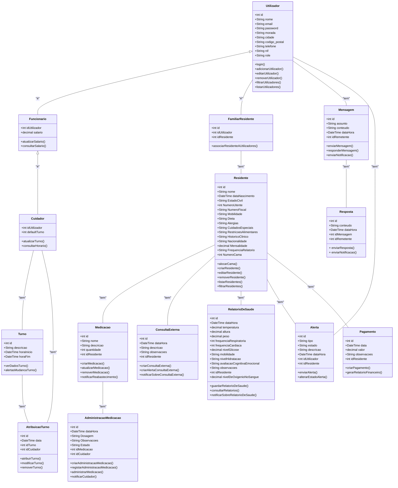

# Diagrama de Classes

```mermaid
classDiagram
    class Utilizador {
        +int id
        +String nome
        +String email
        +String password
        +String morada
        +String cidade
        +String codigo_postal
        +String telefone
        +String nif
        +String role
        +login()
        +adicionarUtilizador()
        +editarUtilizador()
        +removerUtilizador()
        +filtrarUtilizadores()
        +listarUtilizadores()
    }

    class Funcionario {
        +int idUtilizador
        +decimal salario
        +atualizarSalario()
        +consultarSalario()
    }

    class Cuidador {
        +int idUtilizador
        +int defaultTurno
        +atualizarTurno()
        +consultarHorario()
    }

    class Turno {
        +int id
        +String descricao
        +DateTime horaInicio
        +DateTime horaFim
        +verDadosTurno()
        +alertasMudancaTurno()
    }

    class AtribuicaoTurno {
        +int id
        +DateTime data
        +int idTurno
        +int idCuidador
        +atribuirTurno()
        +modificarTurno()
        +removerTurno()
    }

    class Residente {
        +int id
        +String nome
        +DateTime dataNascimento
        +String EstadoCivil
        +int NumeroUtente
        +String NumeroFiscal
        +String Mobilidade
        +String Dieta
        +String Alergias
        +String CuidadosEspeciais
        +String RestricoesAlimentares
        +String HistoricoClinico
        +String Nacionalidade
        +decimal Mensalidade
        +String FrequenciaRelatorio
        +int NumeroCama
        +alocarCama()
        +criarResidente()
        +editarResidente()
        +removerResidente()
        +listarResidentes()
        +filtrarResidentes()
    }

    Utilizador <|-- Funcionario : "é"
    Funcionario <|-- Cuidador : "é"

    Cuidador -- Turno : "tem"
    Cuidador -- AtribuicaoTurno : "tem"

    Turno -- AtribuicaoTurno : "tem"

    Utilizador -- FamiliarResidente : "é"
    FamiliarResidente -- Residente : "tem"

    Residente -- Medicacao : "tem"
    Medicacao -- AdministracaoMedicacao : "tem"

    Residente -- ConsultaExterna : "tem"

    Residente -- RelatorioDeSaude : "tem"

    Utilizador -- Mensagem : "tem"
    Mensagem -- Resposta : "tem"

    Alerta -- Utilizador : "tem"
    Residente -- Alerta : "tem"
    Residente -- Pagamento : "tem"

    class FamiliarResidente {
        +int id
        +int idUtilizador
        +int idResidente
        +associarResidenteAUtilizadores()
    }

    class Medicacao {
        +int id
        +String nome
        +String descricao
        +int quantidade
        +int idResidente
        +criarMedicacao()
        +atualizarMedicacao()
        +removerMedicacao()
        +notificarReabastecimento()
    }

    class AdministracaoMedicacao {
        +int id
        +DateTime dataHora
        +String Dosagem
        +String Observacoes
        +String Estado
        +int idMedicacao
        +int idCuidador
        +criarAdministracaoMedicacao()
        +registarAdministracaoMedicacao()
        +administrarMedicacao()
        +notificarCuidador()
    }

    class ConsultaExterna {
        +int id
        +DateTime dataHora
        +String descricao
        +String observacoes
        +int idResidente
        +criarConsultaExterna()
        +criarAlertaConsultaExterna()
        +notificarSobreConsultaExterna()
    }

    class RelatorioDeSaude {
        +int id
        +DateTime dataHora
        +decimal temperatura
        +decimal altura
        +decimal peso
        +int frequenciaRespiratoria
        +int frequenciaCardiaca
        +decimal nivelGlicose
        +String mobilidade
        +String nivelHidratacao
        +String avaliacaoCognitivaEmocional
        +String observacoes
        +int idResidente
        +decimal nivelDeOxigenioNoSangue
        +guardarRelatorioDeSaude()
        +consultarRelatorios()
        +notificarSobreRelatorioDeSaude()
    }

    class Mensagem {
        +int id
        +String assunto
        +String conteudo
        +DateTime dataHora
        +int idRemetente
        +enviarMensagem()
        +responderMensagem()
        +enviarNotificacao()
    }

    class Resposta {
        +int id
        +String conteudo
        +DateTime dataHora
        +int idMensagem
        +int idRemetente
        + enviarResposta()
        + enviarNotificacao()
    }

    class Alerta {
        +int id
        +String tipo
        +String estado
        +String descricao
        +DateTime dataHora
        +int idUtilizador
        +int idResidente
        +enviarAlerta()
        +alterarEstadoAlerta()
    }

    class Pagamento {
        +int id
        +DateTime data
        +decimal valor
        +String observacoes
        +int idResidente
        +criarPagamento()
        +gerarRelatorioFinanceiro()
    }

```