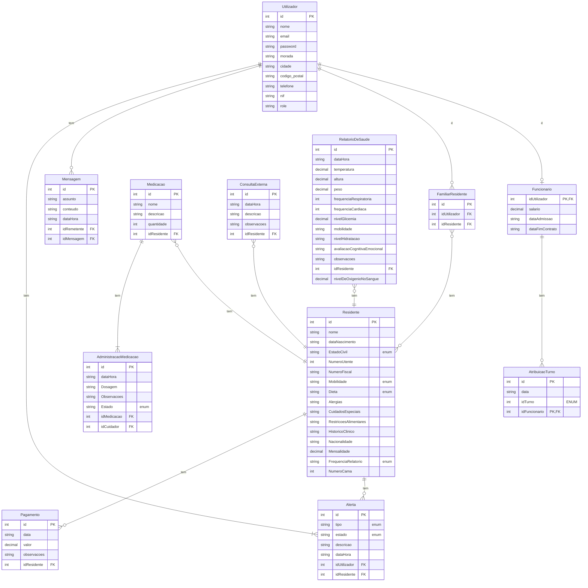

# Modelo de Dados

```mermaid
erDiagram
    Utilizador {
        int id PK
        string nome
        string email
        string password
        string morada
        string cidade
        string codigo_postal
        string telefone
        string nif
        string role
    }

    Utilizador ||--|O Funcionario: "é"

    Funcionario {
        int idUtilizador PK, FK
        decimal salario
        string dataAdmissao
        string dataFimContrato
    }

    Funcionario ||--O{ AtribuicaoTurno: "tem"

    AtribuicaoTurno {
        int id PK
        string data
        int idTurno "ENUM"
        int idFuncionario PK, FK
    }

    Utilizador ||--O{ FamiliarResidente: "é"
    FamiliarResidente {
        int id PK
        int idUtilizador FK
        int idResidente FK
    }

    FamiliarResidente }O--O{ Residente: "tem"
    Residente {
        int id PK
        string nome
        string dataNascimento
        string EstadoCivil "enum"
        int NumeroUtente
        string NumeroFiscal
        string Mobilidade "enum"
        string Dieta "enum" 
        string Alergias
        string CuidadosEspeciais
        string RestricoesAlimentares
        string HistoricoClinico
        string Nacionalidade
        decimal Mensalidade
        string FrequenciaRelatorio "enum"
        int NumeroCama
    }

    Medicacao }O--|| Residente: "tem"

    Medicacao {
        int id PK
        string nome
        string descricao
        int quantidade
        int idResidente FK
    }

    Medicacao ||--|{ AdministracaoMedicacao: "tem"

    AdministracaoMedicacao {
        int id PK
        string dataHora
        string Dosagem
        string Observacoes
        string Estado "enum"
        int idMedicacao FK
        int idCuidador FK
    }

    ConsultaExterna }O--|| Residente: "tem"

    ConsultaExterna {
        int id PK
        string dataHora
        string descricao
        string observacoes
        int idResidente FK
    }

    RelatorioDeSaude }O--|| Residente: "tem"

    RelatorioDeSaude {
        int id PK
        string dataHora
        decimal temperatura
        decimal altura
        decimal peso
        int frequenciaRespiratoria
        int frequenciaCardiaca
        decimal nivelGlicemia
        string mobilidade
        string nivelHidratacao
        string avaliacaoCognitivaEmocional
        string observacoes
        int idResidente FK
        decimal nivelDeOxigenioNoSangue
    }


    Utilizador ||--O{ Mensagem: "tem"
    Mensagem {
        int id PK
        string assunto
        string conteudo
        string dataHora
        int idRemetente FK
        int idMensagem FK
    }

    Alerta }|--|| Utilizador: "tem"
    Alerta {
        int id PK
        string tipo "enum"
        string estado "enum"
        string descricao
        string dataHora
        int idUtilizador FK
        int idResidente FK
    }

    Residente ||--O{ Alerta: "tem"

    Residente ||--O{ Pagamento: "tem"

    Pagamento {
        int id PK
        string data
        decimal valor
        string observacoes
        int idResidente FK
    }
```
