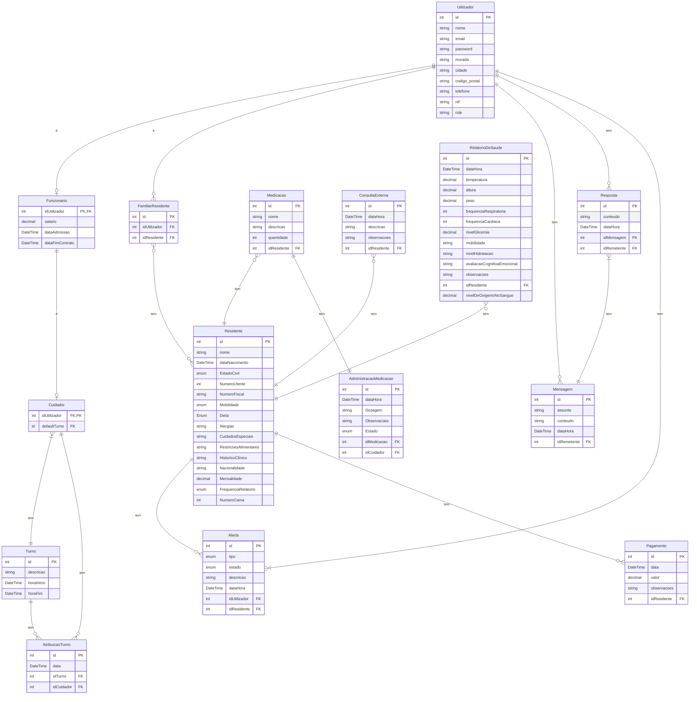

# Modelo de Dados

```mermaid
erDiagram
    Utilizador {
        int id PK
        string nome
        string email
        string password
        string morada
        string cidade
        string codigo_postal
        string telefone
        string nif
        string role
    }

    Utilizador ||--|O Funcionario: "é"

    Funcionario {
        int idUtilizador PK, FK
        decimal salario
        DateTime dataAdmissao
        DateTime dataFimContrato
    }

    Funcionario ||--|O Cuidador: "é"

    Cuidador {
        int idUtilizador FK, PK
        id  defaultTurno FK
    }

    Cuidador }|--|| Turno: "tem"

    Cuidador ||--O{ AtribuicaoTurno: "tem"

    AtribuicaoTurno {
        int id PK
        DateTime data
        int idTurno FK
        int idCuidador FK
    }

    Turno ||--O{ AtribuicaoTurno: "tem"

    Turno {
        int id PK
        string descricao
        DateTime horaInicio
        DateTime horaFim
    }

    Utilizador ||--O{ FamiliarResidente: "é"
    FamiliarResidente {
        int id PK
        int idUtilizador FK
        int idResidente FK
    }

    FamiliarResidente }O--O{ Residente: "tem"
    Residente {
        int id PK
        string nome
        DateTime dataNascimento
        enum EstadoCivil
        int NumeroUtente
        string NumeroFiscal
        enum Mobilidade
        Enum Dieta 
        string Alergias
        string CuidadosEspeciais
        string RestricoesAlimentares
        string HistoricoClinico
        string Nacionalidade
        decimal Mensalidade
        enum FrequenciaRelatorio
        int NumeroCama
    }

    Medicacao }O--|| Residente: "tem"

    Medicacao {
        int id PK
        string nome
        string descricao
        int quantidade
        int idResidente FK
    }

    Medicacao ||--|| AdministracaoMedicacao: "tem"

    AdministracaoMedicacao {
        int id PK
        DateTime dataHora
        string Dosagem
        string Observacoes
        enum Estado
        int idMedicacao FK
        int idCuidador FK
    }

    ConsultaExterna }O--|| Residente: "tem"

    ConsultaExterna {
        int id PK
        DateTime dataHora
        string descricao
        string observacoes
        int idResidente FK
    }

    RelatorioDeSaude }O--|| Residente: "tem"

    RelatorioDeSaude {
        int id PK
        DateTime dataHora
        decimal temperatura
        decimal altura
        decimal peso
        int frequenciaRespiratoria
        int frequenciaCardiaca
        decimal nivelGlicemia
        string mobilidade
        string nivelHidratacao
        string avaliacaoCognitivaEmocional
        string observacoes
        int idResidente FK
        decimal nivelDeOxigenioNoSangue
    }


    Utilizador ||--O{ Mensagem: "tem"
    Mensagem {
        int id PK
        string assunto
        string conteudo
        DateTime dataHora
        int idRemetente FK
    }

    Resposta }|--|| Mensagem: "tem"
    Utilizador ||--O{ Resposta: "tem"
    Resposta {
        int id PK
        string conteudo
        DateTime dataHora
        int idMensagem FK
        int idRemetente FK
    }

    Alerta }|--|| Utilizador: "tem"
    Alerta {
        int id PK
        enum tipo
        enum estado
        string descricao
        DateTime dataHora
        int idUtilizador FK
        int idResidente FK
    }

    Residente ||--O{ Alerta: "tem"

    Residente ||--O{ Pagamento: "tem"

    Pagamento {
        int id PK
        DateTime data
        decimal valor
        string observacoes
        int idResidente FK
    }
```
