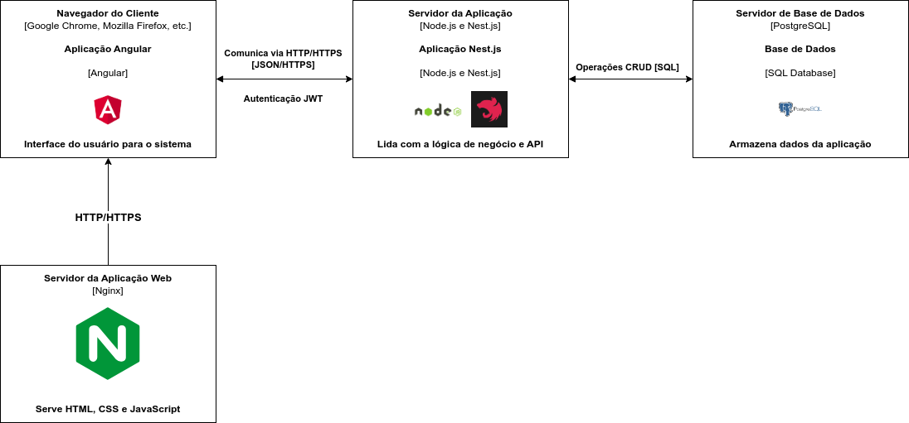

# Projeto 2 - Gestão de um Lar de idosos

## Indice
- [Projeto 2 - Gestão de um Lar de idosos](#projeto-2---gestão-de-um-lar-de-idosos)
  - [Indice](#indice)
  - [Objetivo Geral](#objetivo-geral)
  - [Objetivos Específicos](#objetivos-específicos)
  - [Tecnologias Utilizadas](#tecnologias-utilizadas)
  - [Diagrama de Arquitetura](#diagrama-de-arquitetura)
  - [Casos de Uso](#casos-de-uso)
    - [Casos de uso Gestor e Cuidador](#casos-de-uso-gestor-e-cuidador)
    - [Casos de uso Gestor](#casos-de-uso-gestor)
    - [Casos de uso Cuidador](#casos-de-uso-cuidador)
    - [Casos de uso Familiar](#casos-de-uso-familiar)
  - [Modelo de Dados](#modelo-de-dados)
  - [Dicionario de Dados](#dicionario-de-dados)
  - [Diagrama de Classes](#diagrama-de-classes)
  - [Diagrama de Sequência](#diagrama-de-sequência)

## Objetivo Geral
Desenvolver um projeto no âmbito das Tecnologias e Programação de Sistemas de Informação de forma a dar resposta às necessidades de um cliente/empresa.

## Objetivos Específicos

- Fazer o levantamento dos requisitos e planeamento das tarefas, recursos e prazos de entrega.
- Desenvolver a modelação dos processos de negócio envolvidos, bem como análise funcional do sistema, apresentando o diagrama de casos de uso para cada tipo de utilizador, tendo em conta o propósito, os objetivos de cada utilizador e descrição estruturada dos casos de uso principais.
- Criar o modelo de dados e diagrama de classes.
- Criar diagramas de sequência para os casos de uso mais importantes.
- Criar dicionário de dados para as entidades e processos do core principal da aplicação.
- Implementar a base de dados.
- Construir uma aplicação Web, para a gestão de disponibilidade dos formadores, com vários níveis de acesso e permissões.
- Produzir um relatório que descreva o processo de desenvolvimento do sistema, apresente e critique os resultados obtidos.
- Realizar os testes necessários à aplicação.

## Tecnologias Utilizadas

- [NesJS](https://nestjs.com/)
- [TypeORM](https://typeorm.io/#/)
- [PostgreSQL](https://www.postgresql.org/)
- [Angular](https://angular.io/)
- [Tailwind CSS](https://tailwindcss.com/)
- [DaisyUI](https://daisyui.com/)

## Diagrama de Arquitetura

Para este projeto decidimos criar uma API REST com o NestJS e uma aplicação Web com o Angular.

## Casos de Uso

### Casos de uso Gestor e Cuidador

### Casos de uso Gestor

### Casos de uso Cuidador

### Casos de uso Familiar

## Modelo de Dados

[Ver Modelo de Dados](./ModeloDados.md)

## Dicionario de Dados

[Ver Dicionário de Dados](./DicionarioDados.md)

## Diagrama de Classes

[Ver Diagrama de Classes](./DiagramaClasses.md)

## Diagrama de Sequência

[Ver Diagrama de Sequência](./DiagramasSequencia.md

