# Diagramas de Sequencia

## Camas

### Verificar disponibilidade de camas

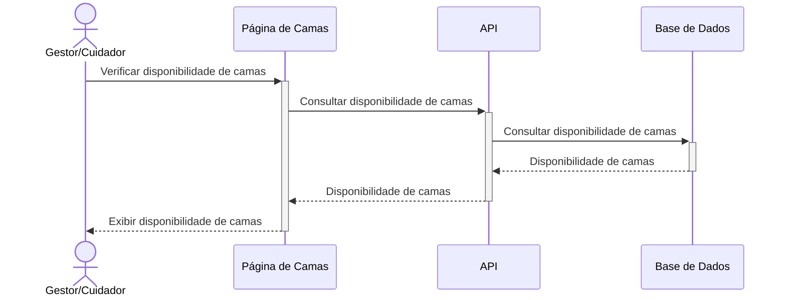
```mermaid
sequenceDiagram
    actor Utilizador as Gestor/Cuidador
    participant PaginaCamas as Página de Camas
    participant API as API
    participant BaseDeDados as Base de Dados

    Utilizador->>+PaginaCamas: Verificar disponibilidade de camas
    PaginaCamas->>+API: Consultar disponibilidade de camas
    API->>+BaseDeDados: Consultar disponibilidade de camas
    BaseDeDados-->>-API: Disponibilidade de camas
    API-->>-PaginaCamas: Disponibilidade de camas
    PaginaCamas-->>-Utilizador: Exibir disponibilidade de camas
```

## Residente

### Listar Residentes

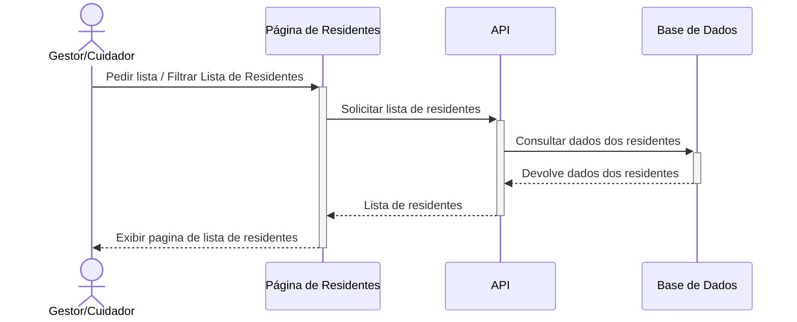
```mermaid
sequenceDiagram
    actor Utilizador as Gestor/Cuidador
    participant PaginaResidente as Página de Residentes
    participant API as API
    participant BaseDeDados as Base de Dados

    Utilizador->>+PaginaResidente: Pedir lista / Filtrar Lista de Residentes
    PaginaResidente->>+API: Solicitar lista de residentes
    API->>+BaseDeDados: Consultar dados dos residentes
    BaseDeDados-->>-API: Devolve dados dos residentes
    API-->>-PaginaResidente: Lista de residentes 
    PaginaResidente-->>-Utilizador: Exibir pagina de lista de residentes
```

### Consultar Residente 

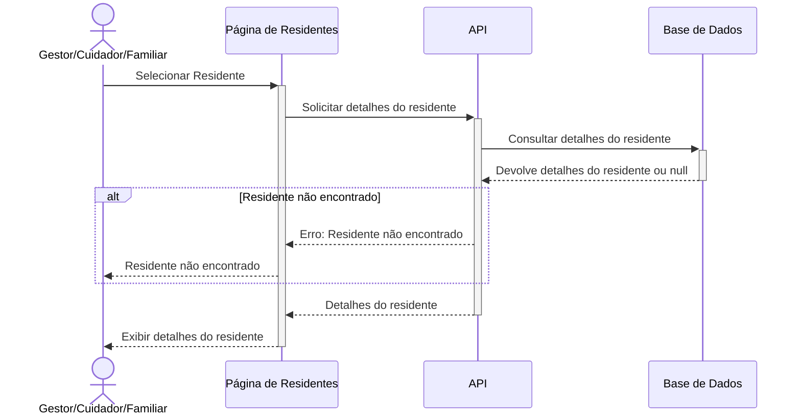
```mermaid
sequenceDiagram
    actor Utilizador as Gestor/Cuidador/Familiar
    participant PaginaResidente as Página de Residentes
    participant API as API
    participant BaseDeDados as Base de Dados

    Utilizador->>+PaginaResidente: Selecionar Residente
    PaginaResidente->>+API: Solicitar detalhes do residente
    API->>+BaseDeDados: Consultar detalhes do residente
    BaseDeDados-->>-API: Devolve detalhes do residente ou null
    alt Residente não encontrado
        API-->>PaginaResidente: Erro: Residente não encontrado
        PaginaResidente-->>Utilizador: Residente não encontrado
    end
    API-->>-PaginaResidente: Detalhes do residente
    PaginaResidente-->>-Utilizador: Exibir detalhes do residente
    
```

### Criar Residente

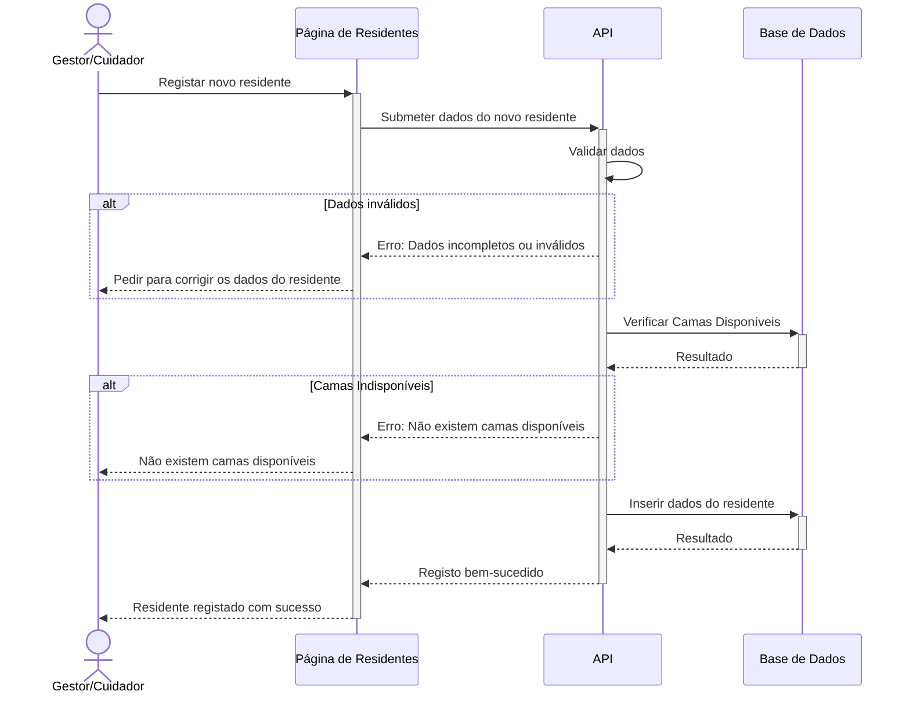
```mermaid
sequenceDiagram
    actor Utilizador as Gestor/Cuidador
    participant PaginaResidente as Página de Residentes
    participant API as API
    participant BaseDeDados as Base de Dados

    Utilizador->>+PaginaResidente: Registar novo residente
    PaginaResidente->>+API: Submeter dados do novo residente
    API->>API: Validar dados
    alt Dados inválidos
        API-->>PaginaResidente: Erro: Dados incompletos ou inválidos
        PaginaResidente-->>Utilizador: Pedir para corrigir os dados do residente
    end
    API->>+BaseDeDados: Verificar Camas Disponíveis
    BaseDeDados-->>-API: Resultado

    alt Camas Indisponíveis
        API-->>PaginaResidente: Erro: Não existem camas disponíveis
        PaginaResidente-->>Utilizador: Não existem camas disponíveis
    end

    API->>+BaseDeDados: Inserir dados do residente
    BaseDeDados-->>-API: Resultado
    API-->>-PaginaResidente: Registo bem-sucedido
    PaginaResidente-->>-Utilizador: Residente registado com sucesso
    
```

### Atualizar Residente

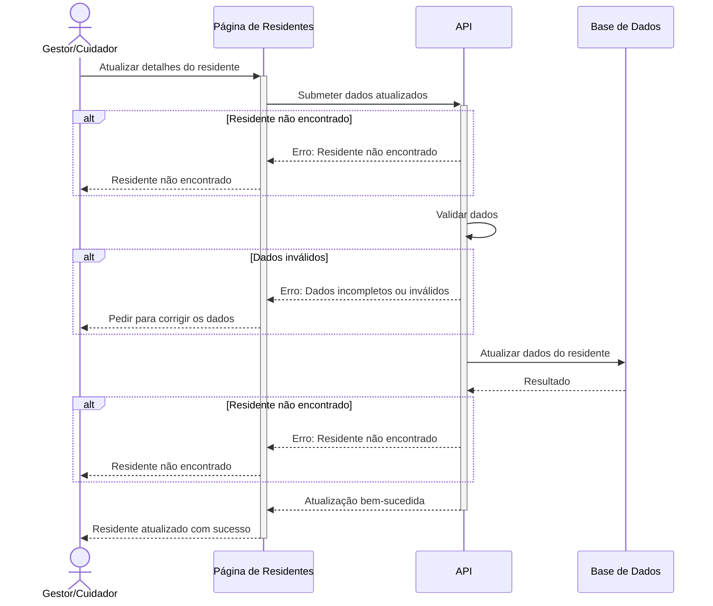
```mermaid
sequenceDiagram
    actor Utilizador as Gestor/Cuidador
    participant PaginaResidente as Página de Residentes
    participant API as API
    participant BaseDeDados as Base de Dados

    Utilizador->>+PaginaResidente: Atualizar detalhes do residente
    PaginaResidente->>+API: Submeter dados atualizados

    alt Residente não encontrado
        API-->>PaginaResidente: Erro: Residente não encontrado
        PaginaResidente-->>Utilizador: Residente não encontrado
    end

    API->>API: Validar dados
    alt Dados inválidos
        API-->>PaginaResidente: Erro: Dados incompletos ou inválidos
        PaginaResidente-->>Utilizador: Pedir para corrigir os dados
    end        
    API->>BaseDeDados: Atualizar dados do residente
    BaseDeDados-->>API: Resultado
    alt Residente não encontrado
        API-->>PaginaResidente: Erro: Residente não encontrado
        PaginaResidente-->>Utilizador: Residente não encontrado
    end
    API-->>-PaginaResidente: Atualização bem-sucedida
    PaginaResidente-->>-Utilizador: Residente atualizado com sucesso


    
```

### Eliminar Residente

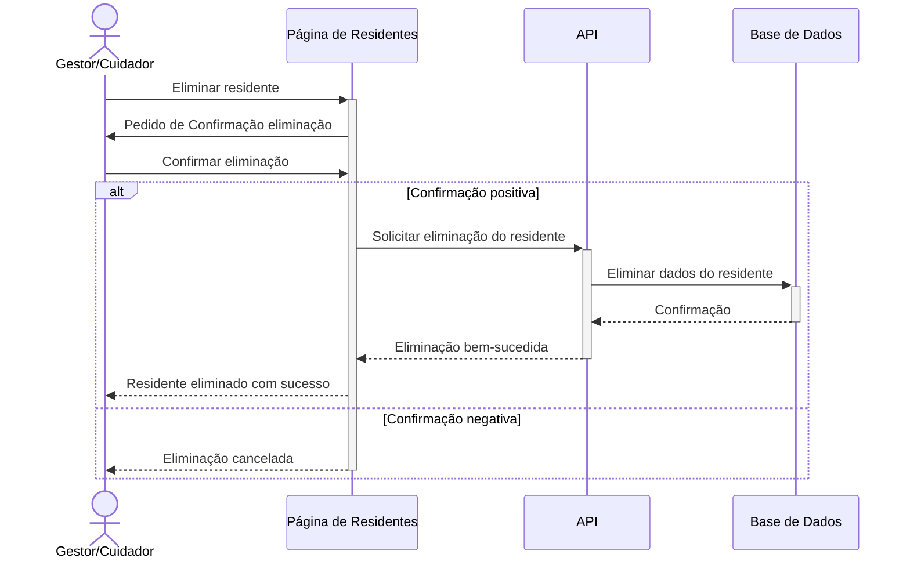
```mermaid
sequenceDiagram
    actor Utilizador as Gestor/Cuidador
    participant PaginaResidente as Página de Residentes
    participant API as API
    participant BaseDeDados as Base de Dados

    Utilizador->>+PaginaResidente: Eliminar residente
    PaginaResidente->>Utilizador: Pedido de Confirmação eliminação
    Utilizador->>PaginaResidente: Confirmar eliminação
    alt Confirmação positiva
        PaginaResidente->>+API: Solicitar eliminação do residente
        API->>+BaseDeDados: Eliminar dados do residente
        BaseDeDados-->>-API: Confirmação
        API-->>-PaginaResidente: Eliminação bem-sucedida
        PaginaResidente-->>Utilizador: Residente eliminado com sucesso
        
    else Confirmação negativa
        PaginaResidente-->>-Utilizador: Eliminação cancelada
    end    
```

## Consultas/Exames

### Listar Consultas

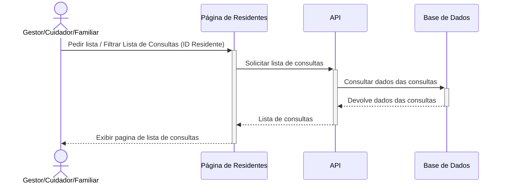
```mermaid
sequenceDiagram
    actor Utilizador as Gestor/Cuidador/Familiar
    participant PaginaResidente as Página de Residentes
    participant API as API
    participant BaseDeDados as Base de Dados

    Utilizador->>+PaginaResidente: Pedir lista / Filtrar Lista de Consultas (ID Residente)
    PaginaResidente->>+API: Solicitar lista de consultas
    API->>+BaseDeDados: Consultar dados das consultas
    BaseDeDados-->>-API: Devolve dados das consultas
    API-->>-PaginaResidente: Lista de consultas 
    PaginaResidente-->>-Utilizador: Exibir pagina de lista de consultas
```

### Consultar Consulta

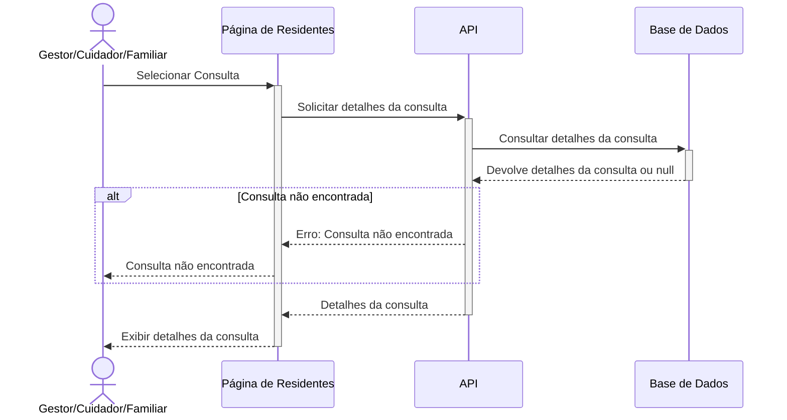
```mermaid
sequenceDiagram
    actor Utilizador as Gestor/Cuidador/Familiar
    participant PaginaResidente as Página de Residentes
    participant API as API
    participant BaseDeDados as Base de Dados

    Utilizador->>+PaginaResidente: Selecionar Consulta
    PaginaResidente->>+API: Solicitar detalhes da consulta
    API->>+BaseDeDados: Consultar detalhes da consulta
    BaseDeDados-->>-API: Devolve detalhes da consulta ou null
    alt Consulta não encontrada
        API-->>PaginaResidente: Erro: Consulta não encontrada
        PaginaResidente-->>Utilizador: Consulta não encontrada
    end
    API-->>-PaginaResidente: Detalhes da consulta
    PaginaResidente-->>-Utilizador: Exibir detalhes da consulta
    
```

### Registar Consulta para Residente

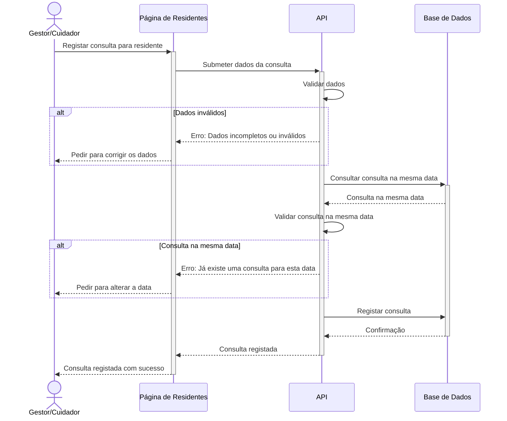
```mermaid
sequenceDiagram
    actor Utilizador as Gestor/Cuidador
    participant PaginaResidente as Página de Residentes
    participant API as API
    participant BaseDeDados as Base de Dados

    Utilizador->>+PaginaResidente: Registar consulta para residente
    PaginaResidente->>+API: Submeter dados da consulta
    API->>API: Validar dados
    alt Dados inválidos
        API-->>PaginaResidente: Erro: Dados incompletos ou inválidos
        PaginaResidente-->>Utilizador: Pedir para corrigir os dados
    end
    API->>+BaseDeDados: Consultar consulta na mesma data
    BaseDeDados-->>API: Consulta na mesma data

    API->>API: Validar consulta na mesma data

    alt Consulta na mesma data
        API-->>PaginaResidente: Erro: Já existe uma consulta para esta data
        PaginaResidente-->>Utilizador: Pedir para alterar a data
    end

    API->>BaseDeDados: Registar consulta
    BaseDeDados-->>-API: Confirmação
    API-->>-PaginaResidente: Consulta registada
    PaginaResidente-->>-Utilizador: Consulta registada com sucesso
```

### Atualizar Consulta

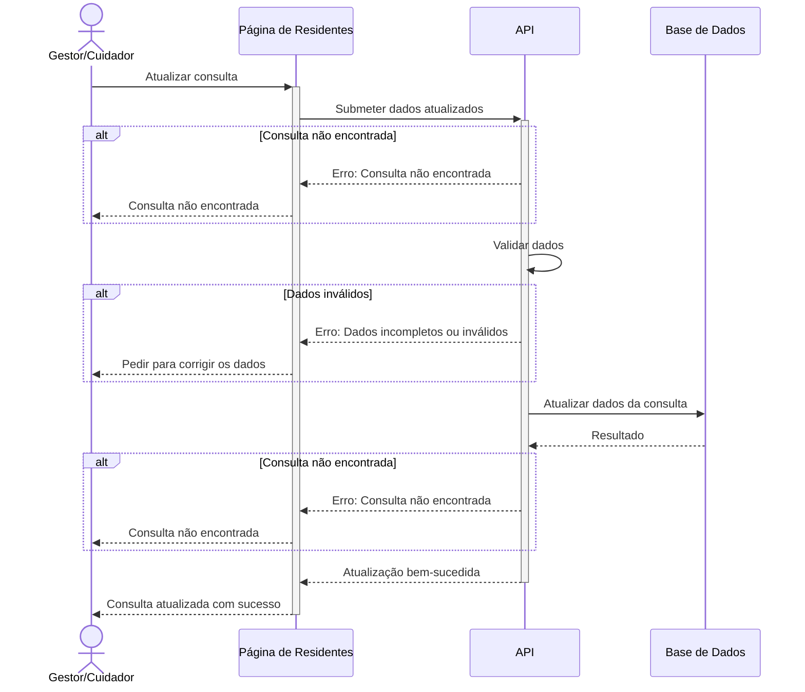
```mermaid
sequenceDiagram
    actor Utilizador as Gestor/Cuidador
    participant PaginaResidente as Página de Residentes
    participant API as API
    participant BaseDeDados as Base de Dados

    Utilizador->>+PaginaResidente: Atualizar consulta
    PaginaResidente->>+API: Submeter dados atualizados

    alt Consulta não encontrada
        API-->>PaginaResidente: Erro: Consulta não encontrada
        PaginaResidente-->>Utilizador: Consulta não encontrada
    end

    API->>API: Validar dados
    alt Dados inválidos
        API-->>PaginaResidente: Erro: Dados incompletos ou inválidos
        PaginaResidente-->>Utilizador: Pedir para corrigir os dados
    end        
    API->>BaseDeDados: Atualizar dados da consulta
    BaseDeDados-->>API: Resultado
    alt Consulta não encontrada
        API-->>PaginaResidente: Erro: Consulta não encontrada
        PaginaResidente-->>Utilizador: Consulta não encontrada
    end
    API-->>-PaginaResidente: Atualização bem-sucedida
    PaginaResidente-->>-Utilizador: Consulta atualizada com sucesso
```

### Eliminar Consulta

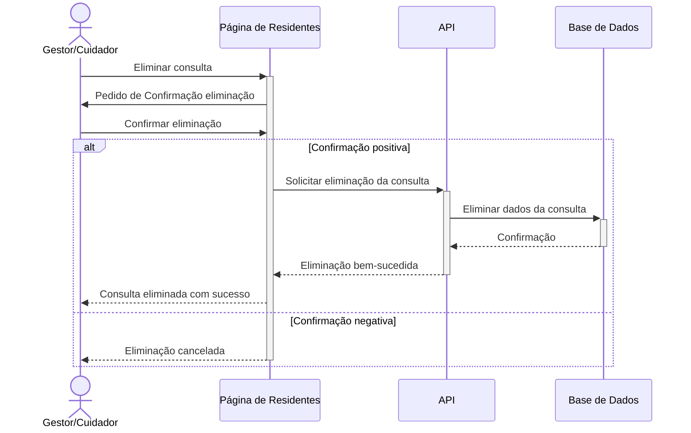
```mermaid
sequenceDiagram
    actor Utilizador as Gestor/Cuidador
    participant PaginaResidente as Página de Residentes
    participant API as API
    participant BaseDeDados as Base de Dados

    Utilizador->>+PaginaResidente: Eliminar consulta
    PaginaResidente->>Utilizador: Pedido de Confirmação eliminação
    Utilizador->>PaginaResidente: Confirmar eliminação
    alt Confirmação positiva
        PaginaResidente->>+API: Solicitar eliminação da consulta
        API->>+BaseDeDados: Eliminar dados da consulta
        BaseDeDados-->>-API: Confirmação
        API-->>-PaginaResidente: Eliminação bem-sucedida
        PaginaResidente-->>Utilizador: Consulta eliminada com sucesso
        
    else Confirmação negativa
        PaginaResidente-->>-Utilizador: Eliminação cancelada
    end    
```

## Medicamentos

### Listar Medicamentos

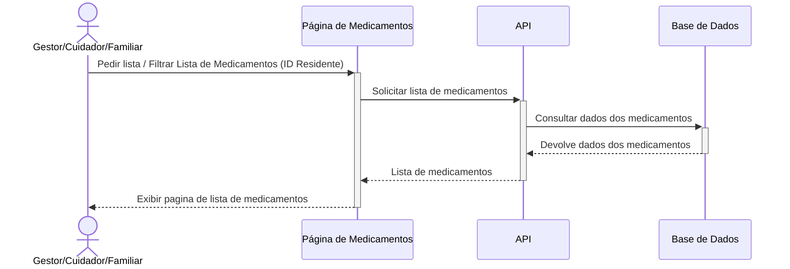
```mermaid
sequenceDiagram
    actor Utilizador as Gestor/Cuidador/Familiar
    participant PaginaMedicamentos as Página de Medicamentos
    participant API as API
    participant BaseDeDados as Base de Dados

    Utilizador->>+PaginaMedicamentos: Pedir lista / Filtrar Lista de Medicamentos (ID Residente)
    PaginaMedicamentos->>+API: Solicitar lista de medicamentos
    API->>+BaseDeDados: Consultar dados dos medicamentos
    BaseDeDados-->>-API: Devolve dados dos medicamentos
    API-->>-PaginaMedicamentos: Lista de medicamentos 
    PaginaMedicamentos-->>-Utilizador: Exibir pagina de lista de medicamentos
```

### Consultar Medicamento

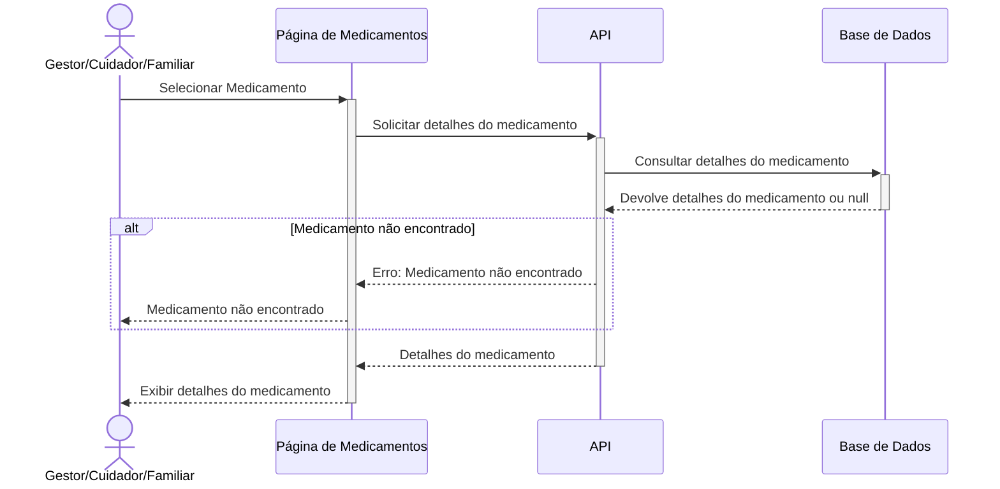
```mermaid
sequenceDiagram
    actor Utilizador as Gestor/Cuidador/Familiar
    participant PaginaMedicamentos as Página de Medicamentos
    participant API as API
    participant BaseDeDados as Base de Dados

    Utilizador->>+PaginaMedicamentos: Selecionar Medicamento
    PaginaMedicamentos->>+API: Solicitar detalhes do medicamento
    API->>+BaseDeDados: Consultar detalhes do medicamento
    BaseDeDados-->>-API: Devolve detalhes do medicamento ou null
    alt Medicamento não encontrado
        API-->>PaginaMedicamentos: Erro: Medicamento não encontrado
        PaginaMedicamentos-->>Utilizador: Medicamento não encontrado
    end
    API-->>-PaginaMedicamentos: Detalhes do medicamento
    PaginaMedicamentos-->>-Utilizador: Exibir detalhes do medicamento
    
```

### Registar Medicamento para Residente

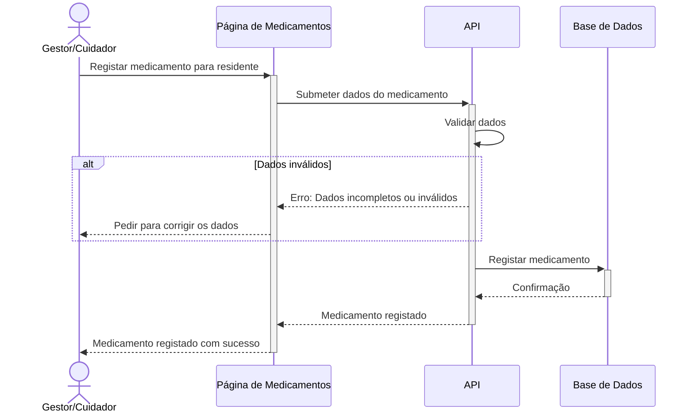
```mermaid
sequenceDiagram
    actor Utilizador as Gestor/Cuidador
    participant PaginaMedicamentos as Página de Medicamentos
    participant API as API
    participant BaseDeDados as Base de Dados

    Utilizador->>+PaginaMedicamentos: Registar medicamento para residente
    PaginaMedicamentos->>+API: Submeter dados do medicamento
    API->>API: Validar dados
    alt Dados inválidos
        API-->>PaginaMedicamentos: Erro: Dados incompletos ou inválidos
        PaginaMedicamentos-->>Utilizador: Pedir para corrigir os dados
    end
    API->>+BaseDeDados: Registar medicamento
    BaseDeDados-->>-API: Confirmação
    API-->>-PaginaMedicamentos: Medicamento registado
    PaginaMedicamentos-->>-Utilizador: Medicamento registado com sucesso
```

### Atualizar Medicamento

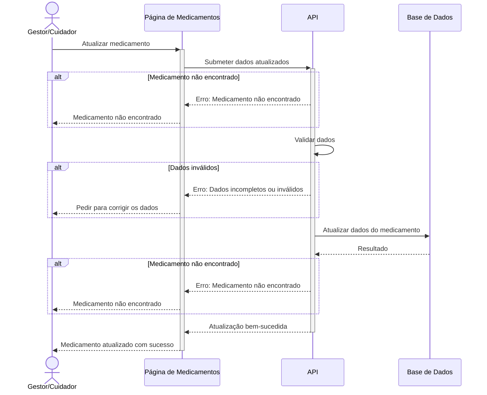
```mermaid
sequenceDiagram
    actor Utilizador as Gestor/Cuidador
    participant PaginaMedicamentos as Página de Medicamentos
    participant API as API
    participant BaseDeDados as Base de Dados

    Utilizador->>+PaginaMedicamentos: Atualizar medicamento
    PaginaMedicamentos->>+API: Submeter dados atualizados

    alt Medicamento não encontrado
        API-->>PaginaMedicamentos: Erro: Medicamento não encontrado
        PaginaMedicamentos-->>Utilizador: Medicamento não encontrado
    end

    API->>API: Validar dados
    alt Dados inválidos
        API-->>PaginaMedicamentos: Erro: Dados incompletos ou inválidos
        PaginaMedicamentos-->>Utilizador: Pedir para corrigir os dados
    end        
    API->>BaseDeDados: Atualizar dados do medicamento
    BaseDeDados-->>API: Resultado
    alt Medicamento não encontrado
        API-->>PaginaMedicamentos: Erro: Medicamento não encontrado
        PaginaMedicamentos-->>Utilizador: Medicamento não encontrado
    end
    API-->>-PaginaMedicamentos: Atualização bem-sucedida
    PaginaMedicamentos-->>-Utilizador: Medicamento atualizado com sucesso
```

### Eliminar Medicamento

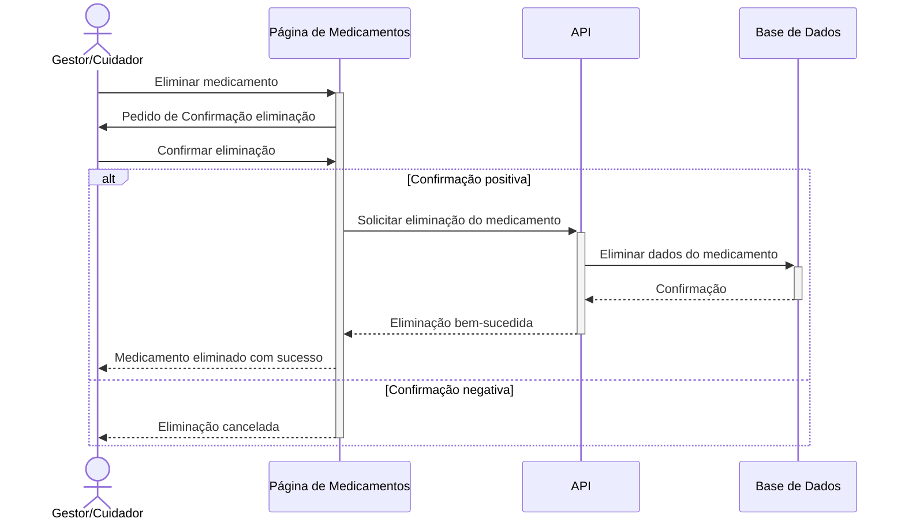
```mermaid
sequenceDiagram
    actor Utilizador as Gestor/Cuidador
    participant PaginaMedicamentos as Página de Medicamentos
    participant API as API
    participant BaseDeDados as Base de Dados

    Utilizador->>+PaginaMedicamentos: Eliminar medicamento
    PaginaMedicamentos->>Utilizador: Pedido de Confirmação eliminação
    Utilizador->>PaginaMedicamentos: Confirmar eliminação
    alt Confirmação positiva
        PaginaMedicamentos->>+API: Solicitar eliminação do medicamento
        API->>+BaseDeDados: Eliminar dados do medicamento
        BaseDeDados-->>-API: Confirmação
        API-->>-PaginaMedicamentos: Eliminação bem-sucedida
        PaginaMedicamentos-->>Utilizador: Medicamento eliminado com sucesso
        
    else Confirmação negativa
        PaginaMedicamentos-->>-Utilizador: Eliminação cancelada
    end    
```

### Agendamento de medicamentos

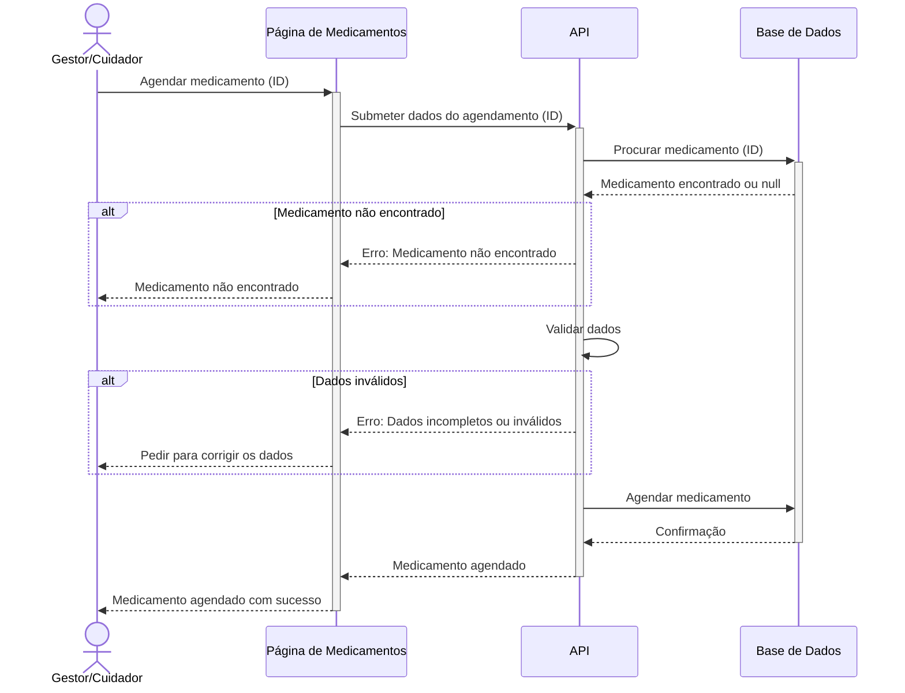
```mermaid
sequenceDiagram
    actor Utilizador as Gestor/Cuidador
    participant PaginaMedicamentos as Página de Medicamentos
    participant API as API
    participant BaseDeDados as Base de Dados

    Utilizador->>+PaginaMedicamentos: Agendar medicamento (ID)
    PaginaMedicamentos->>+API: Submeter dados do agendamento (ID)

    API->>+BaseDeDados: Procurar medicamento (ID)
    BaseDeDados-->>API: Medicamento encontrado ou null

    alt Medicamento não encontrado
        API-->>PaginaMedicamentos: Erro: Medicamento não encontrado
        PaginaMedicamentos-->>Utilizador: Medicamento não encontrado
    end

    API->>API: Validar dados

    alt Dados inválidos
        API-->>PaginaMedicamentos: Erro: Dados incompletos ou inválidos
        PaginaMedicamentos-->>Utilizador: Pedir para corrigir os dados
    end
    API->>BaseDeDados: Agendar medicamento
    BaseDeDados-->>-API: Confirmação
    API-->>-PaginaMedicamentos: Medicamento agendado
    PaginaMedicamentos-->>-Utilizador: Medicamento agendado com sucesso
```

### Apagar agendamento de medicamentos

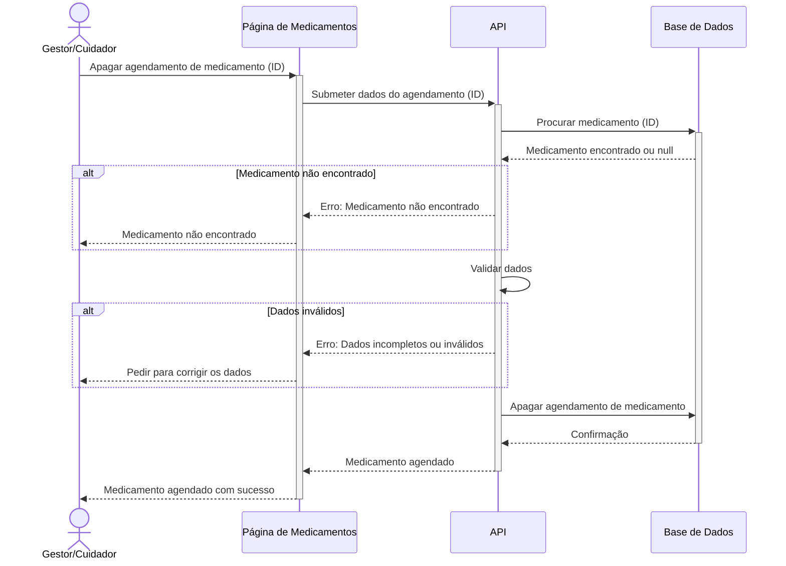
```mermaid
sequenceDiagram
    actor Utilizador as Gestor/Cuidador
    participant PaginaMedicamentos as Página de Medicamentos
    participant API as API
    participant BaseDeDados as Base de Dados

    Utilizador->>+PaginaMedicamentos: Apagar agendamento de medicamento (ID)
    PaginaMedicamentos->>+API: Submeter dados do agendamento (ID)

    API->>+BaseDeDados: Procurar medicamento (ID)
    BaseDeDados-->>API: Medicamento encontrado ou null

    alt Medicamento não encontrado
        API-->>PaginaMedicamentos: Erro: Medicamento não encontrado
        PaginaMedicamentos-->>Utilizador: Medicamento não encontrado
    end

    API->>API: Validar dados

    alt Dados inválidos
        API-->>PaginaMedicamentos: Erro: Dados incompletos ou inválidos
        PaginaMedicamentos-->>Utilizador: Pedir para corrigir os dados
    end
    API->>BaseDeDados: Apagar agendamento de medicamento
    BaseDeDados-->>-API: Confirmação
    API-->>-PaginaMedicamentos: Medicamento agendado
    PaginaMedicamentos-->>-Utilizador: Medicamento agendado com sucesso
```

## Alerta Automático

### Agendamento de Medicamentos

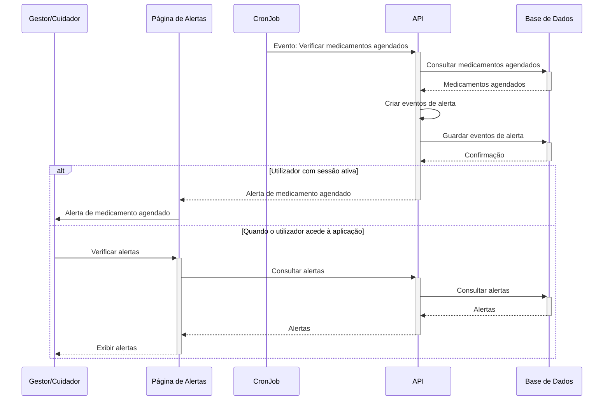
```mermaid
sequenceDiagram
    
    participant user as Gestor/Cuidador
    participant pageAlert as Página de Alertas
    participant CRON as CronJob
    participant API as API
    participant BaseDeDados as Base de Dados

    CRON->>+API: Evento: Verificar medicamentos agendados
    API->>+BaseDeDados: Consultar medicamentos agendados
    BaseDeDados-->>-API: Medicamentos agendados
    API->>API: Criar eventos de alerta
    API->>+BaseDeDados: Guardar eventos de alerta
    BaseDeDados-->>-API: Confirmação

    alt Utilizador com sessão ativa
    API-->>-pageAlert: Alerta de medicamento agendado
    pageAlert->>user: Alerta de medicamento agendado
    else Quando o utilizador acede à aplicação
    user->>+pageAlert: Verificar alertas
    pageAlert->>+API: Consultar alertas
    API->>+BaseDeDados: Consultar alertas
    BaseDeDados-->>-API: Alertas
    API-->>-pageAlert: Alertas
    pageAlert-->>-user: Exibir alertas
    end
```

### Consultas/ Exames

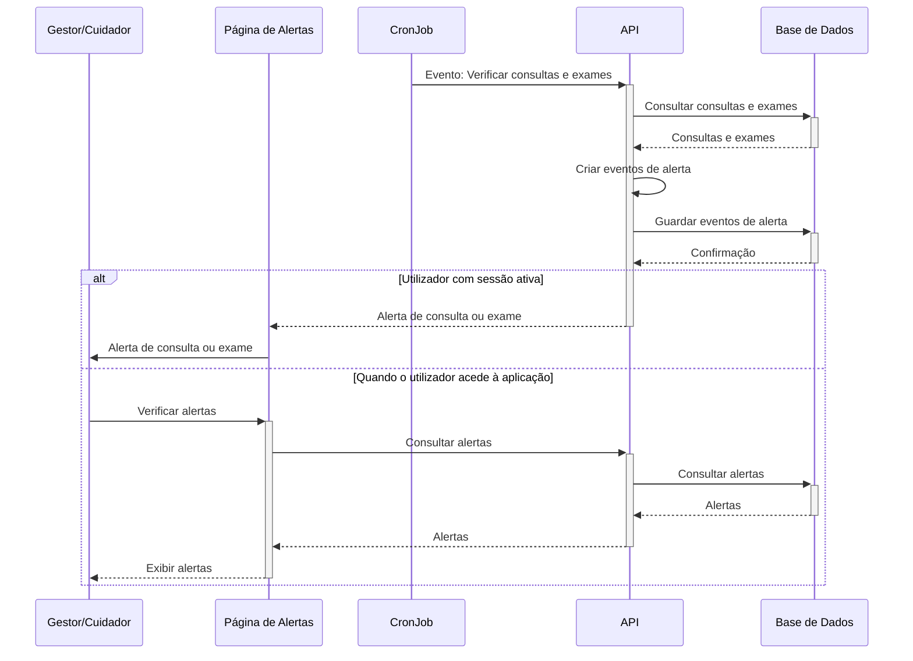
```mermaid
sequenceDiagram
    
    participant user as Gestor/Cuidador
    participant pageAlert as Página de Alertas
    participant CRON as CronJob
    participant API as API
    participant BaseDeDados as Base de Dados

    CRON->>+API: Evento: Verificar consultas e exames
    API->>+BaseDeDados: Consultar consultas e exames
    BaseDeDados-->>-API: Consultas e exames
    API->>API: Criar eventos de alerta
    API->>+BaseDeDados: Guardar eventos de alerta
    BaseDeDados-->>-API: Confirmação

    alt Utilizador com sessão ativa
    API-->>-pageAlert: Alerta de consulta ou exame
    pageAlert->>user: Alerta de consulta ou exame
    else Quando o utilizador acede à aplicação
    user->>+pageAlert: Verificar alertas
    pageAlert->>+API: Consultar alertas
    API->>+BaseDeDados: Consultar alertas
    BaseDeDados-->>-API: Alertas
    API-->>-pageAlert: Alertas
    pageAlert-->>-user: Exibir alertas
    end
```

## Relatórios de Saúde

### Criar Relatório

```mermaid
sequenceDiagram
    actor Utilizador as Gestor/Cuidador
    participant PaginaRelatorios as Página de Relatórios
    participant API as API
    participant BaseDeDados as Base de Dados

    Utilizador->>+PaginaRelatorios: Gerar relatório
    PaginaRelatorios->>+API: Submeter dados para gerar relatório
    API->>+BaseDeDados: Consultar dados de residente
    BaseDeDados-->>-API: Dados de residente
    API->>API: Validar dados
    alt Residente não encontrado
        API-->>PaginaRelatorios: Erro: Residente não encontrado
        PaginaRelatorios-->>Utilizador: Residente não encontrado
    end
    API->>+BaseDeDados: Guardar relatório
    BaseDeDados-->>-API: Confirmação
    API-->>-PaginaRelatorios: Relatório guardado
    PaginaRelatorios-->>-Utilizador: Exibir relatório
```

### Consultar Relatório

```mermaid
sequenceDiagram
    actor Utilizador as Gestor/Cuidador/Familiar
    participant PaginaRelatorios as Página de Relatórios
    participant API as API
    participant BaseDeDados as Base de Dados

    Utilizador->>+PaginaRelatorios: Selecionar relatório
    PaginaRelatorios->>+API: Solicitar detalhes do relatório
    API->>+BaseDeDados: Consultar detalhes do relatório
    BaseDeDados-->>-API: Devolve detalhes do relatório ou null
    alt Relatório não encontrado
        API-->>PaginaRelatorios: Erro: Relatório não encontrado
        PaginaRelatorios-->>Utilizador: Relatório não encontrado
    end
    API-->>-PaginaRelatorios: Detalhes do relatório
    PaginaRelatorios-->>-Utilizador: Exibir detalhes do relatório
```

### Atualizar Relatório

```mermaid
sequenceDiagram
    actor Utilizador as Gestor/Cuidador
    participant PaginaRelatorios as Página de Relatórios
    participant API as API
    participant BaseDeDados as Base de Dados

    Utilizador->>+PaginaRelatorios: Atualizar relatório
    PaginaRelatorios->>+API: Submeter dados atualizados

    alt Relatório não encontrado
        API-->>PaginaRelatorios: Erro: Relatório não encontrado
        PaginaRelatorios-->>Utilizador: Relatório não encontrado
    end

    API->>API: Validar dados
    alt Dados inválidos
        API-->>PaginaRelatorios: Erro: Dados incompletos ou inválidos
        PaginaRelatorios-->>Utilizador: Pedir para corrigir os dados
    end        
    API->>BaseDeDados: Atualizar dados do relatório
    BaseDeDados-->>API: Resultado
    alt Relatório não encontrado
        API-->>PaginaRelatorios: Erro: Relatório não encontrado
        PaginaRelatorios-->>Utilizador: Relatório não encontrado
    end
    API-->>-PaginaRelatorios: Atualização bem-sucedida
    PaginaRelatorios-->>-Utilizador: Relatório atualizado com sucesso
```

### Eliminar Relatório

```mermaid
sequenceDiagram
    actor Utilizador as Gestor/Cuidador
    participant PaginaRelatorios as Página de Relatórios
    participant API as API
    participant BaseDeDados as Base de Dados

    Utilizador->>+PaginaRelatorios: Eliminar relatório
    PaginaRelatorios->>Utilizador: Pedido de Confirmação eliminação
    Utilizador->>PaginaRelatorios: Confirmar eliminação
    alt Confirmação positiva
        PaginaRelatorios->>+API: Solicitar eliminação do relatório
        API->>+BaseDeDados: Eliminar dados do relatório
        BaseDeDados-->>-API: Confirmação
        API-->>-PaginaRelatorios: Eliminação bem-sucedida
        PaginaRelatorios-->>Utilizador: Relatório eliminado com sucesso
        
    else Confirmação negativa
        PaginaRelatorios-->>-Utilizador: Eliminação cancelada
    end    
```

### Utilizadores

### Listar Utilizadores
```mermaid
sequenceDiagram
    actor Utilizador as Gestor
    participant PaginaUtilizadores as Página de Utilizadores
    participant API as API
    participant BaseDeDados as Base de Dados

    Utilizador->>+PaginaUtilizadores: Pedir lista / Filtrar Lista de Utilizadores
    PaginaUtilizadores->>+API: Solicitar lista de utilizadores
    API->>+BaseDeDados: Consultar dados dos utilizadores
    BaseDeDados-->>-API: Devolve dados dos utilizadores
    API-->>-PaginaUtilizadores: Lista de utilizadores 
    PaginaUtilizadores-->>-Utilizador: Exibir pagina de lista de utilizadores
```

### Consultar Utilizador

```mermaid
sequenceDiagram
    actor Utilizador as Gestor
    participant PaginaUtilizadores as Página de Utilizadores
    participant API as API
    participant BaseDeDados as Base de Dados

    Utilizador->>+PaginaUtilizadores: Selecionar Utilizador
    PaginaUtilizadores->>+API: Solicitar detalhes do utilizador
    API->>+BaseDeDados: Consultar detalhes do utilizador
    BaseDeDados-->>-API: Devolve detalhes do utilizador ou null
    alt Utilizador não encontrado
        API-->>PaginaUtilizadores: Erro: Utilizador não encontrado
        PaginaUtilizadores-->>Utilizador: Utilizador não encontrado
    end
    API-->>-PaginaUtilizadores: Detalhes do utilizador
    PaginaUtilizadores-->>-Utilizador: Exibir detalhes do utilizador
```

### Registar Utilizador

```mermaid
sequenceDiagram
    actor Utilizador as Gestor
    participant PaginaUtilizadores as Página de Utilizadores
    participant API as API
    participant BaseDeDados as Base de Dados

    Utilizador->>+PaginaUtilizadores: Registar novo utilizador
    PaginaUtilizadores->>+API: Submeter dados do novo utilizador
    API->>API: Validar dados
    alt Dados inválidos
        API-->>PaginaUtilizadores: Erro: Dados incompletos ou inválidos
        PaginaUtilizadores-->>Utilizador: Pedir para corrigir os dados
    end
    API->>+BaseDeDados: Inserir dados do utilizador
    BaseDeDados-->>-API: Resultado
    API-->>-PaginaUtilizadores: Registo bem-sucedido
    PaginaUtilizadores-->>-Utilizador: Utilizador registado com sucesso
```

### Atualizar Utilizador

```mermaid
sequenceDiagram
    actor Utilizador as Gestor
    participant PaginaUtilizadores as Página de Utilizadores
    participant API as API
    participant BaseDeDados as Base de Dados

    Utilizador->>+PaginaUtilizadores: Atualizar detalhes do utilizador
    PaginaUtilizadores->>+API: Submeter dados atualizados

    alt Utilizador não encontrado
        API-->>PaginaUtilizadores: Erro: Utilizador não encontrado
        PaginaUtilizadores-->>Utilizador: Utilizador não encontrado
    end

    API->>API: Validar dados
    alt Dados inválidos
        API-->>PaginaUtilizadores: Erro: Dados incompletos ou inválidos
        PaginaUtilizadores-->>Utilizador: Pedir para corrigir os dados
    end        
    API->>BaseDeDados: Atualizar dados do utilizador
    BaseDeDados-->>API: Resultado
    alt Utilizador não encontrado
        API-->>PaginaUtilizadores: Erro: Utilizador não encontrado
        PaginaUtilizadores-->>Utilizador: Utilizador não encontrado
    end
    API-->>-PaginaUtilizadores: Atualização bem-sucedida
    PaginaUtilizadores-->>-Utilizador: Utilizador atualizado com sucesso
```

### Eliminar Utilizador

```mermaid
sequenceDiagram
    actor Utilizador as Gestor
    participant PaginaUtilizadores as Página de Utilizadores
    participant API as API
    participant BaseDeDados as Base de Dados

    Utilizador->>+PaginaUtilizadores: Eliminar utilizador
    PaginaUtilizadores->>Utilizador: Pedido de Confirmação eliminação
    Utilizador->>PaginaUtilizadores: Confirmar eliminação
    alt Confirmação positiva
        PaginaUtilizadores->>+API: Solicitar eliminação do utilizador
        API->>+BaseDeDados: Eliminar dados do utilizador
        BaseDeDados-->>-API: Confirmação
        API-->>-PaginaUtilizadores: Eliminação bem-sucedida
        PaginaUtilizadores-->>Utilizador: Utilizador eliminado com sucesso
        
    else Confirmação negativa
        PaginaUtilizadores-->>-Utilizador: Eliminação cancelada
    end    
```

## Funcionários (Gestores e Cuidadores)

### Adicionar Salario

```mermaid
sequenceDiagram
    actor Utilizador as Gestor
    participant PaginaFuncionarios as Página de Funcionários
    participant API as API
    participant BaseDeDados as Base de Dados

    Utilizador->>+PaginaFuncionarios: Adicionar Salário (Id Utilizador)
    PaginaFuncionarios->>+API: Submeter dados do salário
    API->>API: Validar dados
    alt Dados inválidos
        API-->>PaginaFuncionarios: Erro: Dados incompletos ou inválidos
        PaginaFuncionarios-->>Utilizador: Pedir para corrigir os dados
    end

    API->>+BaseDeDados: Verificar Utilizador
    BaseDeDados-->>-API: Utilizador encontrado ou null
    alt Utilizador não encontrado
        API-->>PaginaFuncionarios: Erro: Utilizador não encontrado
        PaginaFuncionarios-->>Utilizador: Utilizador não encontrado
    end

    API->>+BaseDeDados: Adicionar Salário
    BaseDeDados-->>-API: Resultado
    API-->>-PaginaFuncionarios: Salário adicionado
    PaginaFuncionarios-->>-Utilizador: Salário adicionado com sucesso
```

### Atualizar Salario

```mermaid
sequenceDiagram
    actor Utilizador as Gestor
    participant PaginaFuncionarios as Página de Funcionários
    participant API as API
    participant BaseDeDados as Base de Dados

    Utilizador->>+PaginaFuncionarios: Atualizar Salário (Id Utilizador)
    PaginaFuncionarios->>+API: Submeter dados do salário
    API->>API: Validar dados
    alt Dados inválidos
        API-->>PaginaFuncionarios: Erro: Dados incompletos ou inválidos
        PaginaFuncionarios-->>Utilizador: Pedir para corrigir os dados
    end

    API->>+BaseDeDados: Verificar Utilizador
    BaseDeDados-->>-API: Utilizador encontrado ou null
    alt Utilizador não encontrado
        API-->>PaginaFuncionarios: Erro: Utilizador não encontrado
        PaginaFuncionarios-->>Utilizador: Utilizador não encontrado
    end

    API->>+BaseDeDados: Atualizar Salário
    BaseDeDados-->>-API: Resultado
    API-->>-PaginaFuncionarios: Salário atualizado
    PaginaFuncionarios-->>-Utilizador: Salário atualizado com sucesso
```

## Turnos (Cuidadores)

### Adicionar Turno

```mermaid
sequenceDiagram
    actor Utilizador as Gestor
    participant PaginaTurnos as Página de Turnos
    participant API as API
    participant BaseDeDados as Base de Dados

    Utilizador->>+PaginaTurnos: Adicionar Turno (Id Utilizador)
    PaginaTurnos->>+API: Submeter dados do turno
    API->>API: Validar dados
    alt Dados inválidos
        API-->>PaginaTurnos: Erro: Dados incompletos ou inválidos
        PaginaTurnos-->>Utilizador: Pedir para corrigir os dados
    end

    API->>+BaseDeDados: Verificar Utilizador
    BaseDeDados-->>-API: Utilizador encontrado ou null
    alt Utilizador não encontrado
        API-->>PaginaTurnos: Erro: Utilizador não encontrado
        PaginaTurnos-->>Utilizador: Utilizador não encontrado
    end

    API->>+BaseDeDados: Adicionar Turno
    BaseDeDados-->>-API: Resultado
    API-->>API: Criar Notificação
    API-->>-PaginaTurnos: Turno adicionado
    PaginaTurnos-->>-Utilizador: Turno adicionado com sucesso
```

### Atualizar Turno

```mermaid
sequenceDiagram
    actor Utilizador as Gestor
    participant PaginaTurnos as Página de Turnos
    participant API as API
    participant BaseDeDados as Base de Dados

    Utilizador->>+PaginaTurnos: Atualizar Turno (Id Utilizador)
    PaginaTurnos->>+API: Submeter dados do turno
    API->>API: Validar dados
    alt Dados inválidos
        API-->>PaginaTurnos: Erro: Dados incompletos ou inválidos
        PaginaTurnos-->>Utilizador: Pedir para corrigir os dados
    end

    API->>+BaseDeDados: Verificar Utilizador
    BaseDeDados-->>-API: Utilizador encontrado ou null
    alt Utilizador não encontrado
        API-->>PaginaTurnos: Erro: Utilizador não encontrado
        PaginaTurnos-->>Utilizador: Utilizador não encontrado
    end

    API->>+BaseDeDados: Atualizar Turno
    BaseDeDados-->>-API: Resultado
    API-->>API: Criar Notificação
    API-->>-PaginaTurnos: Turno atualizado
    PaginaTurnos-->>-Utilizador: Turno atualizado com sucesso
```

### Atualizar Horario

```mermaid
sequenceDiagram
    actor Utilizador as Gestor
    participant PaginaTurnos as Página de Turnos
    participant API as API
    participant BaseDeDados as Base de Dados

    Utilizador->>+PaginaTurnos: Atualizar Horário (Id Utilizador, Data)
    PaginaTurnos->>+API: Submeter dados do horário
    API->>API: Validar dados
    alt Dados inválidos
        API-->>PaginaTurnos: Erro: Dados incompletos ou inválidos
        PaginaTurnos-->>Utilizador: Pedir para corrigir os dados
    end

    API->>+BaseDeDados: Verificar Utilizador
    BaseDeDados-->>-API: Utilizador encontrado ou null
    alt Utilizador não encontrado
        API-->>PaginaTurnos: Erro: Utilizador não encontrado
        PaginaTurnos-->>Utilizador: Utilizador não encontrado
    end

    API->>+BaseDeDados: Atualizar Horário
    BaseDeDados-->>-API: Resultado
    API-->>API: Criar Notificação
    API-->>-PaginaTurnos: Horário atualizado
    PaginaTurnos-->>-Utilizador: Horário atualizado com sucesso
```

### Preencher Turnos Automaticamente

```mermaid
sequenceDiagram
    actor Utilizador as Gestor
    participant PaginaTurnos as Página de Turnos
    participant API as API
    participant BaseDeDados as Base de Dados

    Utilizador->>+PaginaTurnos: Preencher Turnos
    PaginaTurnos->>+API: Submeter dados mes
    API->>API: Validar dados
    alt Dados inválidos
        API-->>PaginaTurnos: Erro: Dados incompletos ou inválidos
        PaginaTurnos-->>Utilizador: Pedir para corrigir os dados
    end

    API->>+BaseDeDados: Verificar Turnos de Cuidadores
    BaseDeDados-->>-API: Turnos encontrados

    API->>API: Preencher Turnos

    API->>+BaseDeDados: Guardar Turnos de Cuidadores
    BaseDeDados-->>-API: Resultado
    API-->>-PaginaTurnos: Turnos preenchidos
    PaginaTurnos-->>-Utilizador: Turnos preenchidos com sucesso
```

## Gestão Financeira

### Projetar Orçamento para Residente

```mermaid
sequenceDiagram
    actor Utilizador as Gestor
    participant PaginaFinanceira as Página Financeira
    participant API as API
    participant BaseDeDados as Base de Dados

    Utilizador->>+PaginaFinanceira: Projetar Orçamento para Residente
    PaginaFinanceira->>+API: Submeter dados do orçamento(necessidades do residente)
    API->>API: Validar dados
    alt Dados inválidos
        API-->>PaginaFinanceira: Erro: Dados incompletos ou inválidos
        PaginaFinanceira-->>Utilizador: Pedir para corrigir os dados
    end

    API->>+BaseDeDados: Pedir Valores 
    BaseDeDados-->>-API: Valores

    API->>API: Projetar Orçamento

    API-->>-PaginaFinanceira: Orçamento projetado
    PaginaFinanceira-->>-Utilizador: Orçamento projetado com sucesso
```

### Criar/Atualizar Valores
    
```mermaid
sequenceDiagram
    actor Utilizador as Gestor
    participant PaginaFinanceira as Página Financeira
    participant API as API
    participant BaseDeDados as Base de Dados

    Utilizador->>+PaginaFinanceira: Atualizar Valores
    PaginaFinanceira->>+API: Submeter dados dos valores
    API->>API: Validar dados
    alt Dados inválidos
        API-->>PaginaFinanceira: Erro: Dados incompletos ou inválidos
        PaginaFinanceira-->>Utilizador: Pedir para corrigir os dados
    end

    API->>+BaseDeDados: Atualizar ou Criar Valores
    BaseDeDados-->>-API: Resultado
    API-->>-PaginaFinanceira: Valores atualizados
    PaginaFinanceira-->>-Utilizador: Valores atualizados com sucesso
```

### Gerar Relatório Financeiro

```mermaid
sequenceDiagram
    actor Utilizador as Gestor
    participant PaginaFinanceira as Página Financeira
    participant API as API
    participant BaseDeDados as Base de Dados 

    Utilizador->>+PaginaFinanceira: Gerar Relatório Financeiro
    PaginaFinanceira->>+API: Submeter dados para relatório (data)
    API->>API: Validar dados
    alt Dados inválidos
        API-->>PaginaFinanceira: Erro: Dados incompletos ou inválidos
        PaginaFinanceira-->>Utilizador: Pedir para corrigir os dados
    end

    API->>+BaseDeDados: Pedir dados para Relatório
    BaseDeDados-->>-API: Dados

    API->>API: Gerar Relatório

    API-->>-PaginaFinanceira: Relatório gerado
    PaginaFinanceira-->>-Utilizador: Relatório gerado com sucesso
```

### Comunicação Familiares <-> Gestores/Cuidadores

### Enviar Mensagem

```mermaid
sequenceDiagram
    actor Utilizador as Gestor/Cuidador/Familiar
    participant PaginaMensagens as Página de Mensagens
    participant API as API
    participant BaseDeDados as Base de Dados


    Utilizador->>+PaginaMensagens: Enviar Mensagem (remetente, mensagem)
    alt Responder mensagem
        Utilizador->>PaginaMensagens: Responder Mensagem (remetente, mensagem, idConversa)
    end

    PaginaMensagens->>+API: Submeter dados da mensagem
    API->>API: Validar dados
    alt Dados inválidos
        API-->>PaginaMensagens: Erro: Dados incompletos ou inválidos
        PaginaMensagens-->>Utilizador: Pedir para corrigir os dados
    end

    API->>+BaseDeDados: Enviar Mensagem
    BaseDeDados-->>-API: Resultado
    API-->>API: Criar Notificação
    API-->>-PaginaMensagens: Mensagem enviada
    PaginaMensagens-->>-Utilizador: Mensagem enviada com sucesso
```

### Ver Mensagens

```mermaid
---
title: Ver Mensagens
---
sequenceDiagram
    actor Utilizador as Gestor/Cuidador/Familiar
    participant PaginaMensagens as Página de Mensagens
    participant API as API
    participant BaseDeDados as Base de Dados
    opt Utilizador com sessão ativa
        API->>PaginaMensagens: Notificação de Mensagem
        PaginaMensagens->>Utilizador: Notificação de Mensagem
    end

    Utilizador->>+PaginaMensagens: Ver Mensagens
    PaginaMensagens->>+API: Pedir dados de mensagem
    API->>+BaseDeDados: Consultar mensagens
    BaseDeDados-->>-API: Mensagens
    API-->>-PaginaMensagens: Mensagens
    PaginaMensagens-->>-Utilizador: Exibir mensagens
```